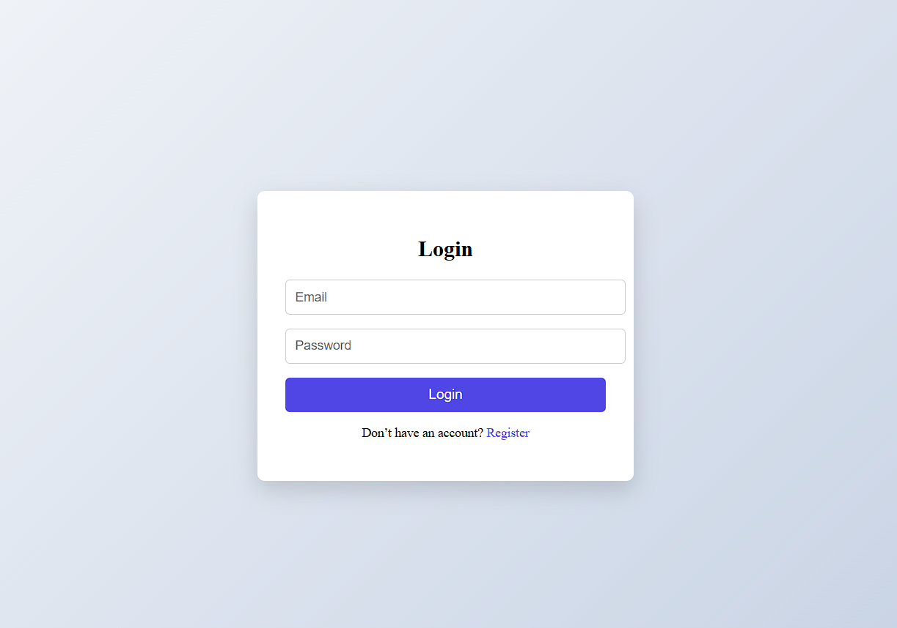
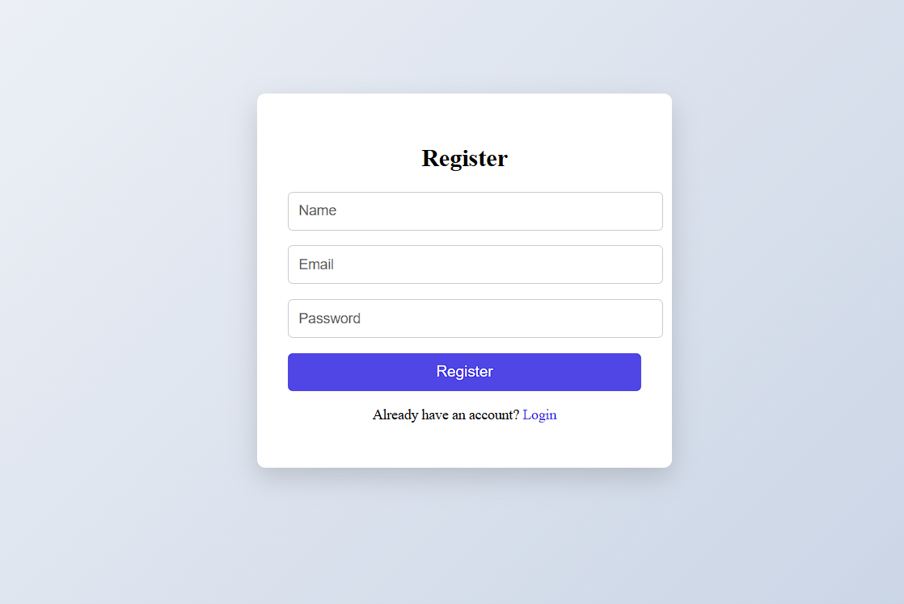
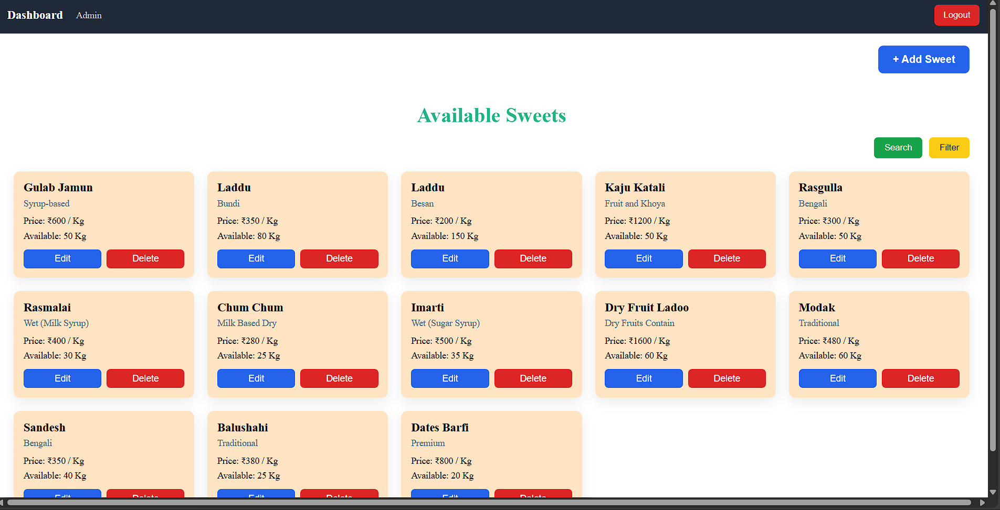
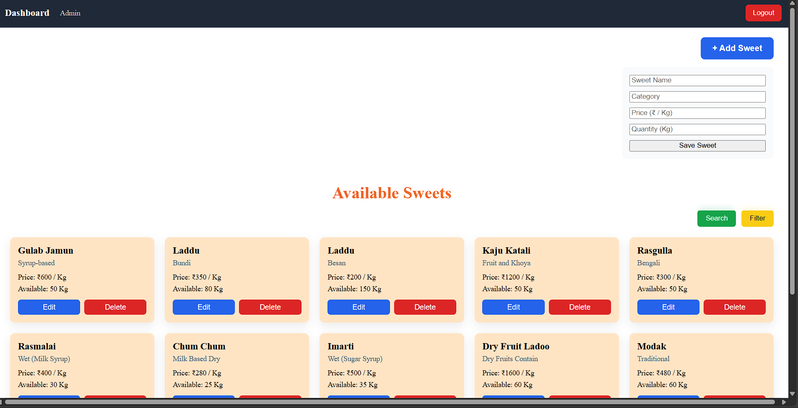
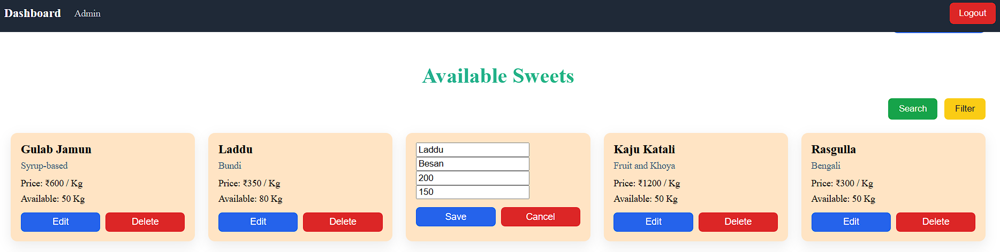
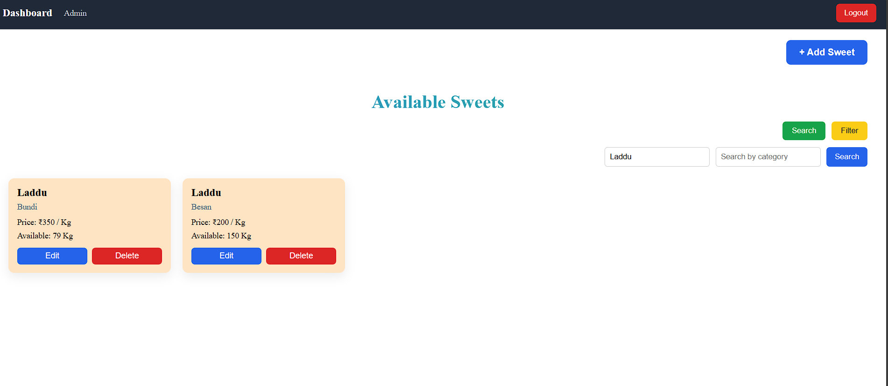
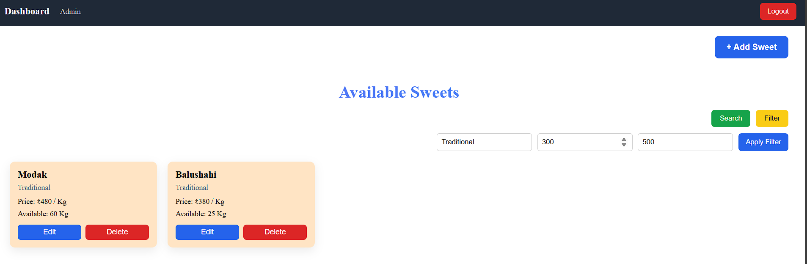
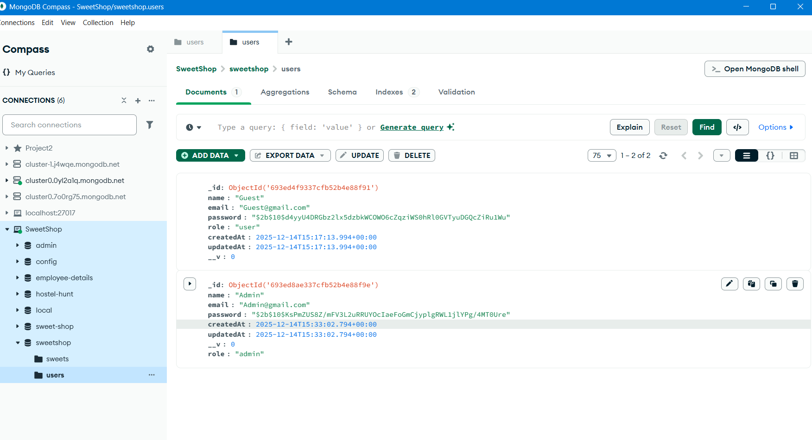
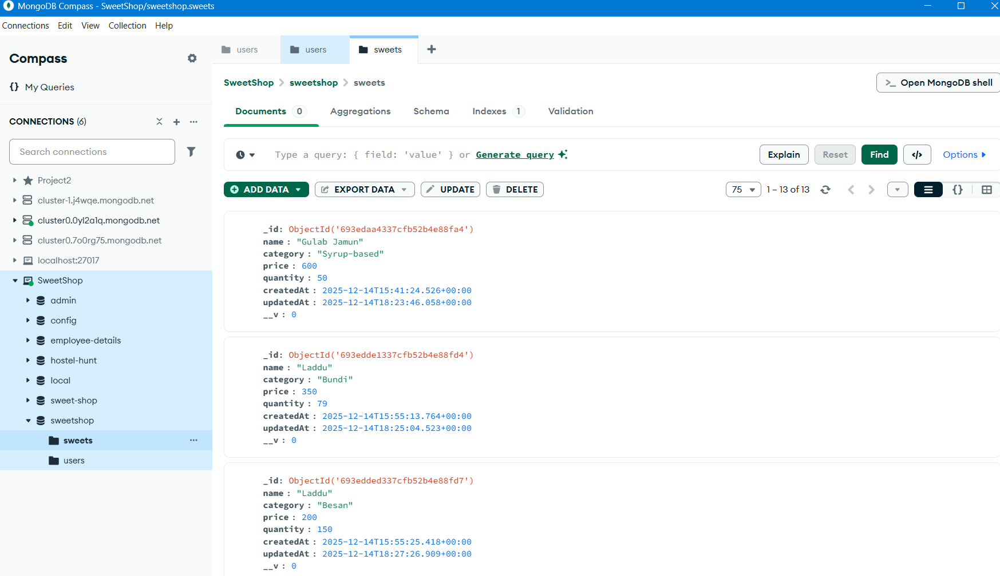

# 🍬 Sweet Shop Management System

A full-stack Sweet Shop Management System built using the **MERN stack**.  
The application supports **role-based access** for Admin and Users, inventory management, and follows **Test-Driven Development (TDD)** principles for backend logic.

---

## 🚀 Features

### 👤 Authentication
- User Registration & Login
- JWT-based authentication
- Role-based access (Admin / User)

### 🧑‍💼 Admin Features
- Add new sweets to inventory
- Prevent duplicate sweets (name + category)
- Inline edit sweet details (price, quantity, category)
- Delete sweets
- View all sweets in a responsive grid layout

### 🛒 User Features
- View available sweets
- Purchase sweets (stock-aware)
- Search sweets by name or category
- Filter sweets by category and price range

### 🔍 Search & Filter
- Toggle-based Search and Filter UI
- Auto-reset results when toggles are closed
- Clean and intuitive UX

---

## 🧪 Test-Driven Development (TDD)

### Backend
- Core business logic developed using **TDD**
- Followed **Red → Green → Refactor** workflow
- Unit tests written for service-layer logic:
  - Duplicate sweet prevention
  - Purchase quantity handling
  - Out-of-stock validation

### Frontend
- Selective TDD applied to critical UI behaviors:
  - Role-based rendering
  - Search/Filter toggle behavior
  - Dashboard rendering

---

## 🛠 Tech Stack

### Frontend
- React (Create React App)
- Context API
- CSS (Grid-based responsive layout)
- Jest & React Testing Library

### Backend
- Node.js
- Express.js
- MongoDB & Mongoose
- JWT Authentication
- Jest & Supertest

---

## 📸 Screenshots

### 🔐 Authentication

**Login Page**  


**Register Page**  


---

### 🧑‍💼 Admin View

**Admin Dashboard**  


**Add Sweet Functionality**  


**Edit Sweet (Inline Editing)**  


---

### 👤 User View

**User Dashboard**  


---

### 🔎 Search & Filter

**Search Functionality**  


**Filter Functionality**  


---

### 🗄 Database

**MongoDB Compass View**  





---

## ⚙️ Setup Instructions

### Backend

```bash
cd backend
npm install
npm run dev
